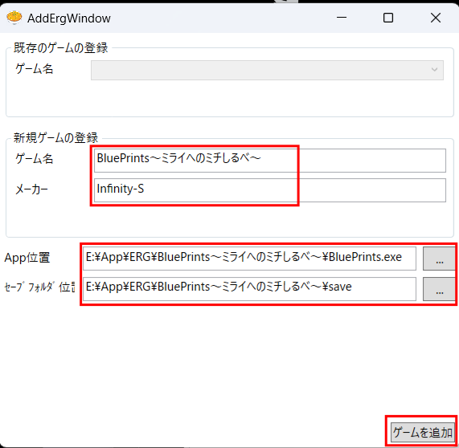

# Tenshinhan(天津飯)

TenshinhanはWindows向けノベルゲームのセーブデータをOneDriveを経由してバックアップ＆共有できるゲームランチャーソフトウェアです。

## ダウンロード方法

[リリース](https://github.com/MogamiTsuchikawa/Tenshinhan/releases/)より最新版をダウンロードします。  
現在
- x64版
- x64ランタイム同梱版
- arm64版  

の3種類をリリースしています。  
.NET 6のランタイムをインストールしていない方はランタイム同梱版（Tenshinhan_*_x64_WithRT.zip）をご利用ください。  
インストーラー無しのソフトウェアなため、解凍後はデスクトップなどに配置して利用ください。  

## ソフトの使い方

### 初回セットアップ

ダウンロードしたZipファイルを解凍し任意のフォルダに配置後、本体のexeファイルを起動します。

SmartScreenにて警告が出ますが、詳細情報をクリックして

実行で動かすことができます。

ソフト起動後、`アカウント`->`ログイン`より使用するOneDriveのMicrosoftアカウントにログインします。

> ※現在 一般ユーザー向けのOneDriveにのみ対応しています。法人・学校向けのOneDrive for Businessへの対応はしていませんのでご注意ください

ブラウザにてログインするアカウントを指定します。

`Authentication complete. You can return to the application. Feel free to close this browser tab.`と表示されたらログイン完了です。

天津飯に戻って`チャーハン天津飯(Microsoftログイン済)`というタイトルになっていれば成功です。

### ソフトの初回登録

> ソフトの初回登録はTenshinhanにソフトをはじめて登録する際に使用します。既にTenshinhanに登録したソフトを他のPCのTenshinhanにも登録する際には後述する`ソフトの2回目以降の登録`を行ってください

`ゲーム`->`新しく買ったゲームを登録`を選択。

赤枠の欄を埋めます。
App位置にはゲーム本体のexeファイルをセーブフォルダ位置にはセーブフォルダを指定します。
完了したら`ゲームを追加`をクリックします

追加後、`ゲーム一覧を更新`をクリックすることで表示されます。

### ゲームの起動とセーブデータのアップロード

Tenshinhanのトップ画面より、遊びたいゲームをクリックすると起動します。

いつも通りプレイ後、アプリを終了するとTenshinhanからセーブデータをOneDriveにアップロードするか聞かれます。

特に起動しただけでゲームを進めていない場合はいいえを選択することでOneDrive上のデータの更新を回避できます。

OneDrive上のセーブデータの方が新しい場合（つまり、他の端末でプレイをして進捗がある場合）起動時にはダウンロードするかのプロンプトが出ます。

### ソフトの2回目以降の登録

既にセーブデータをTenshinhanで管理しているソフトは`既にセーブデータを管理しているゲームを追加する`を用いて追加します。

> この方法を使うと強制的にOneDrive上のセーブデータにローカルを上書きします（つまり、最後に遊んだ状態にローカルのゲームデータを書き換えます）

ゲーム名をプルダウン内から選択し、アプリの位置やセーブデータの位置を設定して`ゲームを追加`をします

追加が完了すると最後に遊んだ日が表示されていることが確認できます。

## バグ報告や機能要望に関して

GitHubのIssueより受け付けています。